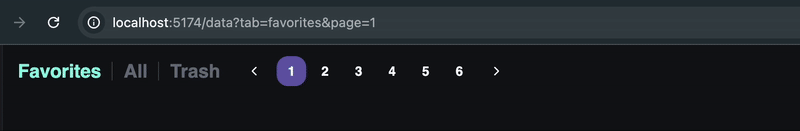

# vue-router-query-sync



> Effortlessly sync Vue Router query parameters with your store or local refs — no boilerplate.

[](https://www.npmjs.com/package/vue-router-query-sync)
[](LICENSE)

---

## ✨ What is this?

`vue-router-query-sync` is a tiny, fully-typed Vue 3 utility that keeps your reactive state
(Pinia store fields or local refs) in sync with the current URL query string — both ways.

- Changes in your store update the URL query.
- Changes in the URL query update your store.
- Batched updates prevent excessive `router.replace` calls.

---

## 💡 Why use this plugin?

- 🔄 Keeps your app state and URL perfectly in sync — no more manual watchers or `router.replace` logic.
- 🧠 Works with **Pinia**, **local refs**, or any reactive source.
- 🧩 Handles multiple query keys and isolated contexts safely.
- ⚙️ Fully typed with TypeScript and designed for Vue 3’s Composition API.
- 🚀 Tiny footprint — optimized for production.

## ✅ Requirements

- Vue 3
- Vue Router 4

---

## 🚀 Installation

```bash
npm install vue-router-query-sync
# or
yarn add vue-router-query-sync
# or
pnpm add vue-router-query-sync
```

---

## ⚙️ Setup

```ts
// main.ts
import { createApp } from 'vue'
import { createRouter, createWebHistory } from 'vue-router'
import routerQuerySync from 'vue-router-query-sync'
import App from './App.vue'

const router = createRouter({
  history: createWebHistory(),
  routes: []
})

createApp(App)
  .use(router)
  .use(routerQuerySync, { router })
  .mount('#app')
```

---

## 🧩 Basic Usage

You can use `useQuerySync` several times in one component.

#### Sync a value with a query param named `tab`:

- Visiting `?tab=favorite` sets `tab.value = 'favorite'`.
- Changing `tab.value = 'all'` updates the URL to `?tab=all`.

```ts
import { useQuerySync } from 'vue-router-query-sync'

const tab = ref<'favorite' | 'all'>('all')

useQuerySync(
  'tab',
  () => tab.value,
  (val) => (tab.value = val)
)
```

### Multiple values
#### Sync a value with a query param named `brands`:

- Visiting `?brands=lg%samsung` sets `brands.value = ['lg', 'samsung']`.
- Changing `brands.value = ['lg']` updates the URL to `?brands=lg`.

```ts
import { useQuerySync } from 'vue-router-query-sync'

const brands = [
    { value: 'lg', label: 'LG' },
    { value: 'samsung', label: 'Samsung' }
]

const selectedBrands = ref<string[]>([])

useQuerySync(
    'brands',
    () => {
        return selectedBrands.value.length > 0 ? selectedBrands.value.join('%') : null
    },
    (val) => {
        if (typeof val === 'string' && val) {
            selectedBrands.value = val.includes('%') ? val.split('%') : [val]
        } else {
            selectedBrands.value = []
        }
    }
)
```
---

## 🔧 API

```ts
function useQuerySync<T extends string | number>(
  key: string,
  get: () => T | null,
  set: (val: T) => void,
  options?: QuerySyncOptions
): void

type QuerySyncOptions = {
  deps?: Ref<unknown>[]
  context?: string
}
```

- **key**: Query parameter name, e.g., `'tab'`.
- **get**: Function returning the current value from your store/ref. Return `null` to indicate “no value”.
- **set**: Function that writes the value to your store/ref.
- **options.deps**: Array of refs. If provided, the initial sync runs after any of these deps change (useful when state is populated asynchronously).
- **options.context**: If the same query key may be used multiple times on the same page, provide a unique context to avoid collisions. The actual query key becomes `${context}_${key}`.

---

## ❗ Important

If a page can have multiple components with the same query key, pass a unique `context` to avoid conflicts.
The real key used in the URL will be `${context}_${key}`. Otherwise, use unique keys per component.

---

## 🏷️ Context Example

If two widgets on the same page need a `tab` param, use unique contexts:

```ts
useQuerySync('tab', () => usersStore.tab, (v) => (usersStore.tab = v), { context: 'users' })
useQuerySync('tab', () => ordersStore.tab, (v) => (ordersStore.tab = v), { context: 'orders' })
// URL keys will be: users_tab and orders_tab
```

---

## ⏳ Delayed/Dependent Initialization

If your state becomes available later (e.g., after a request), delay the initial sync with `deps`:

```ts
const isReady = ref(false)

useQuerySync('sort', () => store.sort, (v) => (store.sort = v), { deps: [isReady] })

// Later when data is loaded:
isReady.value = true
```

---

## 📦 Exports

```ts
import routerQuerySync, { useQuerySync, replaceRouterQueue } from 'vue-router-query-sync'
```

- **default**: Vue plugin to register with `app.use(routerQuerySync, { router })`.
- **useQuerySync**: The composable described above.
- **replaceRouterQueue**: Internal helper that batches query updates (exported in case you need manual batching).

Note: `setRouter/getRouter` are internal; prefer using the plugin install.

---

## 🔒 TypeScript

`useQuerySync` is fully typed. You can annotate the expected type if needed:

```ts
useQuerySync<number>('page', () => page.value, (v) => (page.value = v))
```

Values must be `string` or `number`.

---

## 📄 License

MIT © Ivan Chikachev


